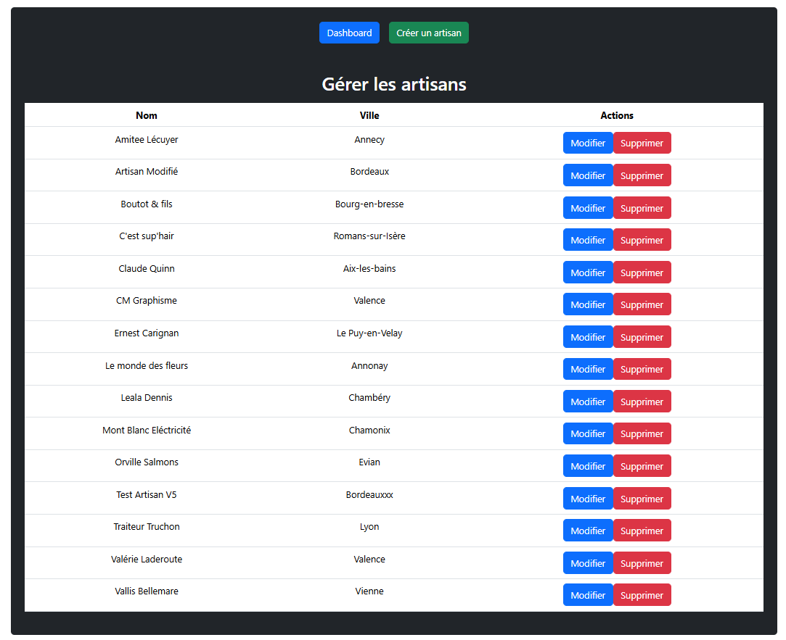
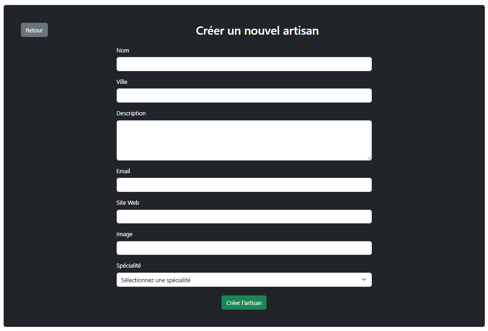
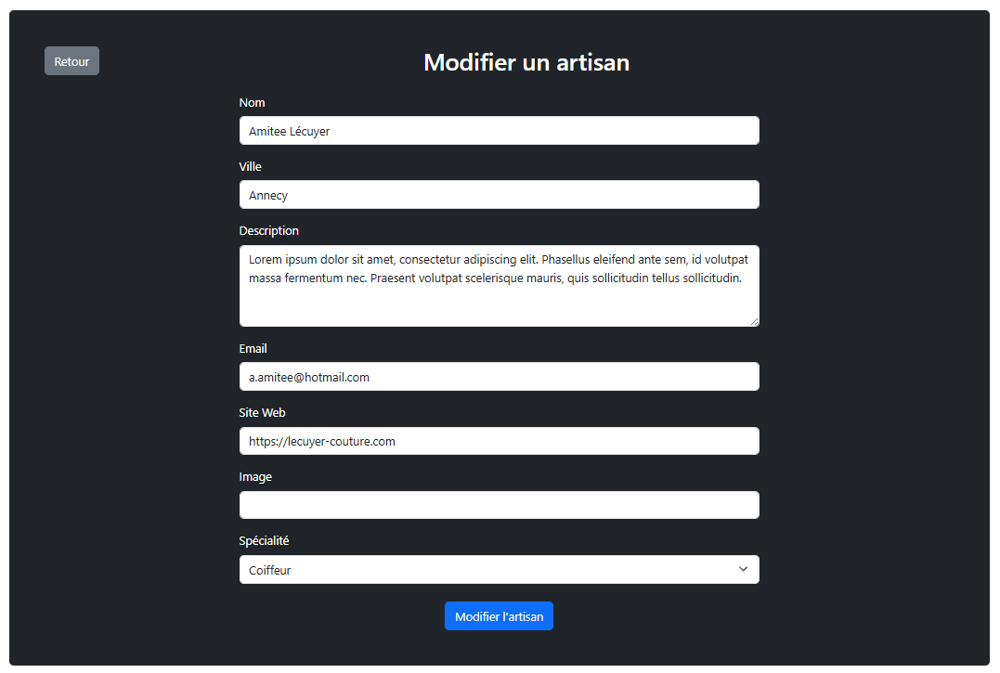

# Trouve ton artisan

Application web développée dans le cadre de la formation Développeur Web FullStack.

Cette plateforme permet aux utilisateurs de rechercher un artisan par catégorie, consulter sa fiche détaillée et contacter un artisan. Une interface d'administration sécurisée permet également la gestion complète des artisans.

---

## Fonctionnalités

### Partie publique

* Consultation des artisans
* Recherche par catégorie
* Recherche par mot-clé
* Consultation de la fiche détaillée d'un artisan
* Affichage des artisans mis en avant
* Formulaire de contact sécurisé

### Partie administration

Comment acceder au menu admin : [/admin/login](http://localhost:5173/admin/login)
* Authentification administrateur (JWT)
* Tableau de bord administrateur
* Création d'un artisan
* Modification d'un artisan
* Suppression d'un artisan
* Protection des routes administrateur

---

## Technologies utilisées

### Frontend

* React
* Vite
* React Router
* Bootstrap
* Fetch API

### Backend

* Node.js
* Express
* Sequelize
* MySQL

### Sécurité

* JSON Web Token (JWT)
* Helmet
* CORS
* Express Rate Limit

### Services

* Nodemailer

---

## Architecture du projet

Trouve-ton-artisan/
│
├── api/
│ ├── src/
│ ├── sql/
│ └── .env
│
├── client/
│ ├── src/
│ └── .env
│
└── README.md

---

## Installation

### Cloner le projet

```bash
git clone <https://github.com/DaYSyDJiK/Trouve_ton_artisan>
```

### Installer le backend

```bash
cd api
npm install
```

### Installer le frontend

```bash
cd client
npm install
```

---

## Configuration de la base de données

Créer une base de données :

```sql
trouve_ton_artisan
```

Puis exécuter :

```txt
api/sql/01_create.sql
api/sql/02_seed.sql
```

---

## Variables d'environnement

### Backend (`api/.env`)

```env
PORT=5000

DB_HOST=localhost
DB_USER=root
DB_PASSWORD=
DB_NAME=trouve_ton_artisan

JWT_SECRET=votre_secret_jwt

MAIL_HOST=smtp.gmail.com
MAIL_PORT=587
MAIL_USER=your-email@gmail.com
MAIL_PASS=your-app-password
```

### Frontend (`client/.env`)

```env
VITE_API_URL=http://localhost:5000
```

---

## Lancement du projet

### Backend

```bash
cd api
npm run dev
```

Serveur disponible sur :

```txt
http://localhost:5000
```

### Frontend

```bash
cd client
npm run dev
```

Application disponible sur :

```txt
http://localhost:5173
```

---

## Routes API principales

### Public

```http
GET /health
GET /categories
GET /specialites
GET /artisans
GET /artisans/:id
GET /artisans/top
POST /contact
```

### Administration

```http
POST /auth/login

POST /admin/artisans
PUT /admin/artisans/:id
DELETE /admin/artisans/:id
```

---

## Sécurité

* Authentification JWT
* Middleware de protection des routes administrateur
* Validation des données côté serveur
* Protection contre les injections SQL via Sequelize
* Configuration CORS
* Helmet
* Rate limiting

---

## Accessibilité

* Structure HTML sémantique
* Navigation clavier
* Labels associés aux champs de formulaire
* Contrastes respectés
* Images avec attribut alt

---

## Auteur

Projet réalisé par Maxime Gauthier dans le cadre de la formation Développeur Web et Web Mobile (DWWM).





